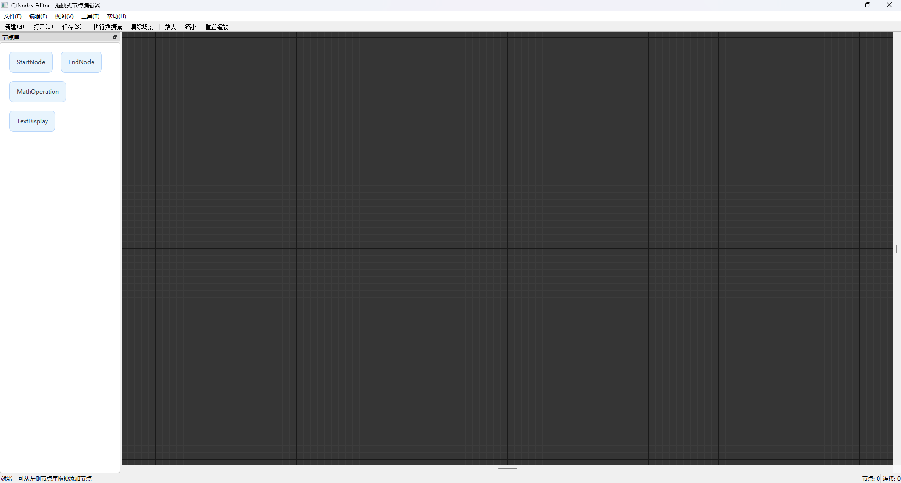
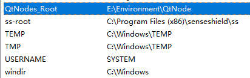

# QtNodeEditorDemo

流程编辑器示例程序

代码获取：[douziguo/NodeEditorDemo](https://github.com/douziguo/NodeEditorDemo)

作者：douziguo

## 一、编译

开发环境：MSVC2019+QT5.14.2

编译前需要下载[QtNodeEditor源码] [paceholder/nodeeditor: Qt Node Editor. Dataflow programming framework](https://github.com/paceholder/nodeeditor)

**这里编译源码的时候要注意Qt版本，源码是推荐Qt6的；如果使用Qt6以下的版本注意把源码中USE_QT6设为OFF**

并配置环境变量

## 二、结构

nodeeditorDemo/
├── bin/
├── cmake/
├── doc/
├── .gitignore
├── BasicNodes.cpp
├── BasicNodes.h
├── CMakeLists.txt
├── main.cpp
├── mainwindow.cpp
├── mainwindow.h
├── NodeEditorCore.cpp
├── NodeEditorCore.h
└── MReadme.md

